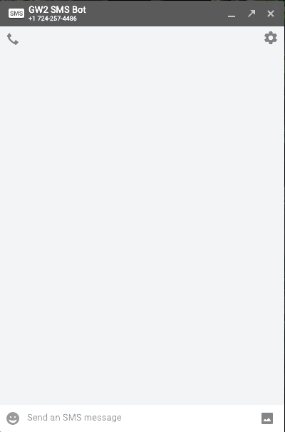
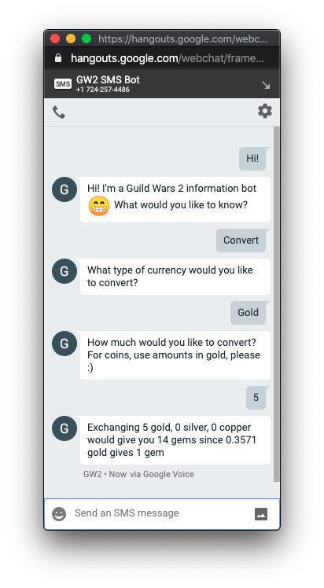
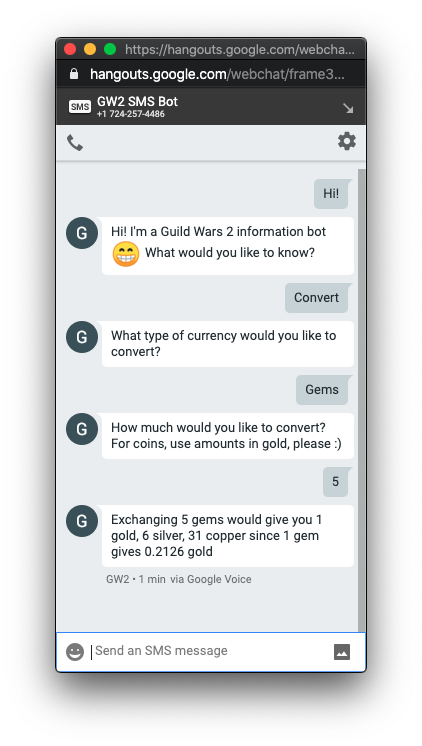

# GW2-SMS-Bot

## How It Works

This chatbot uses Python and Flask to connect the Twilio API with the Guild Wars
2 API. It's hosted on Heroku, and you can talk to it via SMS texting.

## Features

- In Twilio
  - Greets the user and listens for additional commands
  - If the user requests help, lists the currently implemented commands
  - If the user says goodbye, sends the user a farewell message
  - Listens for if the user wants to supply an api key
- In Python
  - Asks for an amount and type of currency and returns the amount in another
    currency (gold to gems, gems to gold)
  - Accepts the API key and stores it for usage elsewhere (currently there's no
    integration with the Account api, so it is unused)

## How To Use It

- Text (724) 257-4486 :smile:

### Demo

 

 

## How To Make It

### Requirements

- Python3
  - Package requirements can be installed with
    `python -m pip install -r requirements.txt`
- A [Twilio](https://www.twilio.com) account (trial is fine)

### Set-up and Configuration

1. Clone this repository
2. Create a `twilio.env` at the project root
3. Add your Twilio credentials to the .env file
   - Follow the official
     [Twilio credential documentation](https://www.twilio.com/docs/usage/secure-credentials)
     for more information, as they keep it up-to-date
   - Environment values used: TWILIO_AUTH_TOKEN
     - This is used to validate requests come from Twilio

## Feature Request

Log an issue with the
[Github repository](https://github.com/ItsASine/GW2-SMS-Bot/issues) to request
additional features!

Current ideas for future functionality include:

- Account statistics, utilizing api keys
- Quaggans
